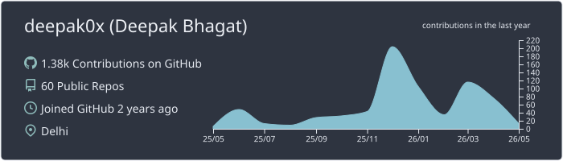
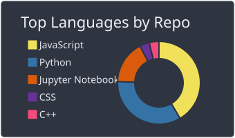

<h1 align="center">Hi 👋, I'm Deepak Bhagat</h1>
<h3 align="center">A Passionate Software Engineer from Delhi, India</h3>

  

- 🌱 I’m currently learning **Networking and DevOps**.

- 📫 How to reach me: **deepak1@me.iitr.ac.in**

- 🌐 Check out my portfolio: [https://portfolio-deepak-bhagat.vercel.app/](https://portfolio-deepak-bhagat.vercel.app/)

<h3 align="left">Connect with me:</h3>

<h3 align="left">Languages and Tools:</h3>

 
 

